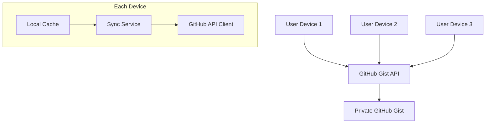

# Design Document

## Overview

This design implements cross-device data persistence for the audiobook library using GitHub Gist as a simple cloud database. The solution provides automatic syncing across devices while maintaining compatibility with GitHub Pages static hosting.

## Architecture

### High-Level Architecture



### Data Flow

1. **Initial Setup**: User provides GitHub personal access token
2. **First Sync**: App creates or finds existing audiobook gist
3. **Read Operations**: Load data from gist, cache locally
4. **Write Operations**: Update local cache, sync to gist
5. **Cross-Device**: Other devices pull latest changes automatically

## Components and Interfaces

### 1. GitHub Gist Service

**Purpose**: Handles all GitHub Gist API interactions

```javascript
class GitHubGistService {
  constructor(token) {
    this.token = token;
    this.gistId = null;
    this.baseUrl = 'https://api.github.com';
  }

  async authenticate() { /* Validate token */ }
  async findOrCreateGist() { /* Find existing or create new gist */ }
  async saveData(data) { /* Update gist with audiobook data */ }
  async loadData() { /* Fetch audiobook data from gist */ }
  async deleteGist() { /* Remove gist entirely */ }
}
```

### 2. Sync Manager

**Purpose**: Orchestrates syncing between local cache and GitHub Gist

```javascript
class SyncManager {
  constructor(gistService, localCache) {
    this.gistService = gistService;
    this.localCache = localCache;
    this.syncInterval = 30000; // 30 seconds
  }

  async initialize() { /* Setup sync process */ }
  async syncToCloud() { /* Push local changes to gist */ }
  async syncFromCloud() { /* Pull remote changes to local */ }
  async handleConflicts(local, remote) { /* Resolve sync conflicts */ }
  startAutoSync() { /* Begin periodic syncing */ }
  stopAutoSync() { /* Stop periodic syncing */ }
}
```

### 3. Local Cache Service

**Purpose**: Provides fast local access and offline functionality

```javascript
class LocalCacheService {
  constructor() {
    this.storageKey = 'audiobook-library-cache';
  }

  saveData(data) { /* Store in localStorage */ }
  loadData() { /* Retrieve from localStorage */ }
  clearData() { /* Remove all cached data */ }
  getLastSyncTime() { /* Track when last synced */ }
  setLastSyncTime(timestamp) { /* Update sync timestamp */ }
}
```

### 4. Authentication Manager

**Purpose**: Handles GitHub token management and validation

```javascript
class AuthManager {
  constructor() {
    this.tokenKey = 'github-token';
  }

  saveToken(token) { /* Securely store token */ }
  getToken() { /* Retrieve stored token */ }
  clearToken() { /* Remove token */ }
  async validateToken(token) { /* Test token with GitHub API */ }
}
```

## Data Models

### Gist Structure

The GitHub Gist will contain a single file with the following structure:

```json
{
  "metadata": {
    "version": "1.0",
    "lastModified": "2024-01-15T10:30:00Z",
    "deviceId": "device-uuid",
    "appVersion": "1.0.0"
  },
  "audiobooks": [
    {
      "id": "unique-id",
      "title": "Book Title",
      "author": "Author Name",
      "narrator": "Narrator Name",
      "genres": ["fantasy", "adventure"],
      "moods": ["fast-paced", "funny"],
      "rating": 4.5,
      "length": "12h 34m",
      "price": "$14.95",
      "imageUrl": "https://...",
      "audibleUrl": "https://...",
      "releaseDate": "2024-01-01",
      "dateAdded": "2024-01-15T10:30:00Z",
      "lastModified": "2024-01-15T10:30:00Z"
    }
  ]
}
```

### Sync Metadata

```javascript
const syncMetadata = {
  lastSyncTime: timestamp,
  conflictResolution: 'manual|auto-local|auto-remote',
  syncStatus: 'synced|pending|error|offline',
  deviceId: 'unique-device-identifier'
};
```

## Error Handling

### Authentication Errors

- **Invalid Token**: Clear stored token, prompt for new one
- **Expired Token**: Show renewal instructions with GitHub link
- **Rate Limited**: Implement exponential backoff, show user-friendly message

### Network Errors

- **No Internet**: Use cached data, show offline indicator
- **GitHub API Down**: Fall back to local-only mode, queue changes
- **Timeout**: Retry with exponential backoff

### Sync Conflicts

- **Timestamp Comparison**: Use last modified times to detect conflicts
- **Conflict Resolution Options**:
  - Manual: Show diff, let user choose
  - Auto-Local: Always prefer local changes
  - Auto-Remote: Always prefer remote changes

### Data Validation

- **Schema Validation**: Ensure gist data matches expected structure
- **Corruption Recovery**: Fall back to local cache if gist is corrupted
- **Migration**: Handle version upgrades gracefully

## Testing Strategy

### Unit Tests

- **GitHubGistService**: Mock GitHub API responses
- **SyncManager**: Test conflict resolution logic
- **LocalCacheService**: Test localStorage operations
- **AuthManager**: Test token validation and storage

### Integration Tests

- **End-to-End Sync**: Test complete sync cycle
- **Cross-Device Simulation**: Mock multiple devices syncing
- **Error Scenarios**: Test network failures, invalid tokens
- **Data Integrity**: Verify data consistency across sync operations

### Manual Testing

- **Multi-Device Setup**: Test on actual devices (Mac, phone, tablet)
- **Network Conditions**: Test with poor/no connectivity
- **Token Management**: Test token creation and renewal process
- **User Experience**: Verify setup flow is intuitive

## Security Considerations

### Token Storage

- Store GitHub token in localStorage (acceptable for personal use)
- Never log or expose token in console/errors
- Provide clear instructions for token permissions (gist scope only)

### Data Privacy

- Use private gists (not public)
- No sensitive data in audiobook records
- User controls their own GitHub account and data

### API Security

- Use HTTPS for all GitHub API calls
- Implement proper error handling to avoid token leakage
- Validate all API responses before processing

## Performance Optimizations

### Sync Efficiency

- **Delta Sync**: Only sync changed records, not entire dataset
- **Compression**: Gzip JSON data before sending to GitHub
- **Batching**: Group multiple changes into single API call
- **Debouncing**: Wait for user to finish editing before syncing

### Caching Strategy

- **Aggressive Local Caching**: Keep full dataset in localStorage
- **Background Sync**: Sync in background without blocking UI
- **Optimistic Updates**: Update UI immediately, sync in background
- **Conflict Indicators**: Show sync status in UI

### API Rate Limiting

- **Respect GitHub Limits**: 5000 requests/hour for authenticated users
- **Exponential Backoff**: Increase delay between retries
- **Queue Management**: Queue changes when rate limited
- **User Feedback**: Show sync status and any delays